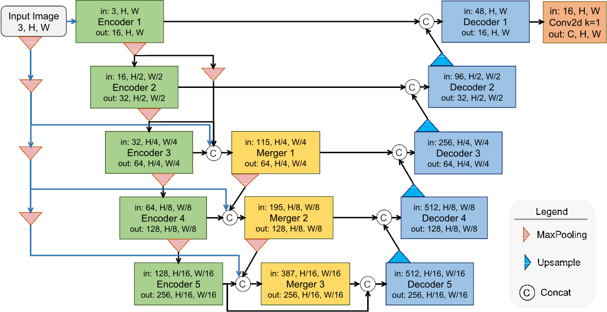

# UMergeNet

A convolutional neural network designed for semantic segmentation tasks.  
With approximately **1.7 million trainable parameters**, UMergeNet achieves performance comparable to larger, widely adopted architectures such as **U-Net**, **Attention U-Net**, and **DeepLabV3**.

---

## Architecture

<p align="center">
  
</p>

---

## Instructions

This repository includes scripts for **data augmentation** and **training** using UMergeNet on the following datasets.  
You must download each dataset manually from its respective source:

- **FuSeg**: [Foot Ulcer Segmentation Challenge](https://github.com/uwm-bigdata/wound-segmentation/tree/master/data/Foot%20Ulcer%20Segmentation%20Challenge)  
- **ISIC 2018**: [ISIC Archive](https://challenge.isic-archive.com/data/#2018)  
- **LaRS**: [LaRS Dataset](https://lojzezust.github.io/lars-dataset/)  
- **GlaS 2015**: [MICCAI Gland Segmentation](https://www.kaggle.com/datasets/sani84/glasmiccai2015-gland-segmentation)

---

## Usage

1. After downloading the desired dataset, extract it to a folder of your choice.  
2. Open the notebook **`Augmentation.ipynb`** and set the variable:

```python
original_dataset_path = "/path/to/your/dataset"
```

Run all cells to generate the augmented dataset.

Then open UMergeNet.ipynb to train and evaluate the model.

If you encounter dependency issues, use the provided environment.yml file to recreate the environment:

```bash
conda env create -f environment.yml
conda activate umergenet
```

3. If you prefer to use your own training environment, the UMergeNet code is located inside the umergenet folder.

## Credits to Other Networks

This repository also includes training with other networks such as:
- [U-Net](https://github.com/LeeJunHyun/Image_Segmentation/tree/master)
- [Attention U-Net](https://github.com/LeeJunHyun/Image_Segmentation/tree/master)
- [Attention R2U-Net](https://github.com/LeeJunHyun/Image_Segmentation/tree/master)
- [ULite](https://github.com/duong-db/U-Lite)
- [UNext](https://github.com/jeya-maria-jose/UNeXt-pytorch)
- [DeepLabV3](https://github.com/tensorflow/models/tree/master/research/deeplab)
- [YOLOv11](https://docs.ultralytics.com/pt/models/yolo11/)
